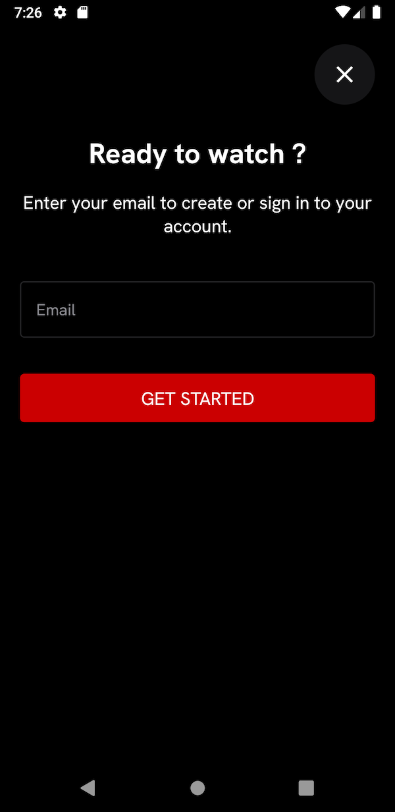
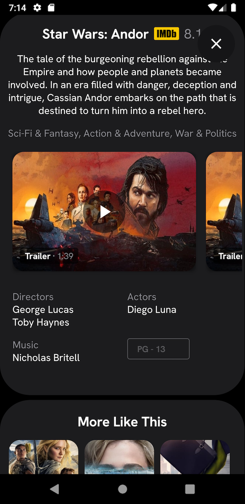

<h1 align="center">
  <a href="http://davidcobbina.com" target="_blank">davidcobbina.com</a>
</h1>

<h1 align="center">
 Disney+, But Better
</h1>

## Project Overview
Disney Plus is a movie streaming app designed by <a href="https://www.behance.net/andrecarioca" target="_blank"> Andre Carioca</a>. He describes the project as his attempt of making the current disney plus app better. 
For me, this project is my attempt of learning and getting my hands dirty with Jetpack Compose. My goal for this project is to learning how to do things in compose way. 
it will cover the following:
* building UI with compose 
* managing state in compose
* Making network calls, 
* saving in a local database (Room)
* Saving Datastore Preferences
* Writing Unit Tests
* Handling exceptions etc.

## Designs
* Designed by <a href="https://www.behance.net/andrecarioca" target="_blank"> Andre Carioca</a>
* Find <a href="https://www.behance.net/gallery/141700011/Disney-But-Better?tracking_source=search_projects%7Cui%20app%20design" target="_blank"> Behance Showcase Here</a>
* Find <a href="https://www.figma.com/proto/xt7i2dLqTEcwLmQjMknDud/Disney%2B%2C-But-Better?node-id=1170%3A87578&starting-point-node-id=1170%3A87578" target="_blank"> Figma Preview Here</a>

## Features
*   Creating Multiple Profiles
*   Discover Disney Movies
*   Add Favorite Movies To WatchList (To be Added)
*   Download Movies Feature (To be Added)
*   MVVM with Android Architecture
*   Dagger Hilt
*   Kotlin Coroutines
*   Material design.

## Libraries
* Jetpack Compose
* Navigation Compose
* Material 3
* Lottie Compose
* Kotlin Coroutines
* ViewModel
* Room
* Coil
* Retrofit
* DataStore Preferences
* ExoPlayer

## Getting Started
You will need an API key from themoviedb.org to request data. If you don’t already have an account, you will need to [create one](https://www.google.com/url?q=https://www.themoviedb.org/account/signup&sa=D&ust=1533333489625000) in order to
request an API Key.
Use your API key as the value for API_KEY in the file local.properties file in the root folder

## Screenshots
<h4 align="center">

